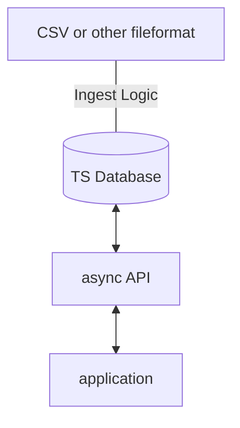

# Data Engineering Time Series Challenge

## Intro

Swissgrid is building a dedicated time series database and therefore wants you to do a scalabe Minimal Viable Product. 
You get provided a sample dataset of the "to be frequency of the grid" for 2 months in 30sec resolution. Design the solution so it is scalable to hundreds of such timeseries from 15 min resolution to secondly resolutions.
The goal of the challenges is to ingest the sample data set effeciently into this database and put a asynchronous API framework of your choice on top to query the data to provide data for different applications.


**Please invest no more than 6 to 8 hours.**

If you cannot complete the task in this time frame, document where you got stuck, so we can use this as a basis for
discussion for your next interview.

## Your challenge in a nutshell:

### Starting Point

* sample timeseries in this repository in CSV format
* Preferred & already in place programming language is python although you can use different languages & technologies if you can argument it
* Your solution has be packaged so we can run it(this is part of the challenge), so either use containers or language specific builds

### Abstract solution design



### Step 1

* Make technology choices for the database and the API framework and document why you chose them(Hint: we like [adrs](https://adr.github.io/)).

### Step 2

* Start and configure database 
* Ingest data to database
* Write API component to query data
* Test both components 

## Evaluation criteria

What we're looking for:

* Clean project setup
* The ability to determine the actual problem area and find a suitable solution
* Relevant tests for your code
* Scratch features when necessary, time is short!
* Document your approach, your decisions, and your general notes

## Preparations for interview

* open your IDE
* have a running version of your app ready
* prepare to present your approach for 5-10 min (no slides!)
* be prepared to answer a few questions after your presentation

<br><br>
<br><br>
---

# Solution Overview

## 1. Technology Choices (Database and API)
- **TimescaleDB** (built on PostgreSQL) is used as the database. TimescaleDB is a purpose-built time-series database that extends PostgreSQL, combining the reliability and flexibility of PostgreSQL with advanced time-series features such as efficient storage, fast queries, automatic partitioning, and scalability for large datasets. This makes it ideal for handling time-series workloads in production environments.

  **Hypertable Concept:**
  A hypertable is the central concept in TimescaleDB for efficiently handling large volumes of time-series data. Think of it this way: a regular PostgreSQL table stores all data in one place, which can become slow and unwieldy as it grows. A hypertable, on the other hand, is a "virtual" table that automatically breaks down the data into smaller, manageable pieces called chunks.

  **How It Works:**
  A hypertable looks and acts just like a normal PostgreSQL, however under the hood, TimescaleDB automatically partitions the data based on a time column (in your case, the timestamp column). This enables fast queries, efficient storage, and seamless scalability as the dataset grows. More on this in the ingestion perfomance scores.

- **FastAPI** is chosen for high-performance web framework for building APIs with Python. It supports asynchronous programming, automatic data validation, interactive documentation (Swagger UI), and is designed for speed and developer productivity. This makes it ideal for building scalable, robust, and easy-to-maintain APIs for data-driven applications.

## 2. Packaging and Runnability
- The entire solution (API and database) is encapsulated in **Docker** containers. This ensures easy setup and reproducibility for any evaluator.
- The project is structured for clean builds and quick onboarding.

## 3. Efficient Data Ingestion
- Data is ingested using local Python scripts, with several strategies available:
  - `ingestion_perf.py` for fastest bulk ingestion.
  - `swissgrid_frequency_data`: Ingests the original dataset (2 months, 30s resolution, ~260k records).
  - `volume_frequency_data`: For persistent, large datasets (1 year, 1s resolution, ~31.5M records).
  - `stresstest_frequency_data`: For live stress testing and performance evaluation.

## 4. Solution Details
- **Clean Project Setup:** Docker-based setup is clean and reproducible.
- **Problem-Solving:** Technology choices and ingestion approach show understanding of data engineering challenges.
- **Documentation:** All decisions and approaches are documented, following ADRs principles.
- **Testing:** Simple tests verify database connectivity and API functionality.

---

# Run the Solution

## Prerequisites
- **Python 3.11+**
- **Docker** (Desktop or Engine)

## Setup Steps
1. **Clone the repository:**
   ```sh
   git clone https://github.com/Patxi91/Swissgrid-TimeSeries-Project
   cd Swissgrid-TimeSeries-Project
   ```
2. **Create and activate a Python virtual environment (optional but recommended):**
   ```sh
   python -m venv .venv
   source .venv/bin/activate  # On Windows: .venv\Scripts\activate
   pip install -r requirements.txt
   ```
3. **Install Docker:**
   - Download and install Docker Desktop from [docker.com](https://www.docker.com/products/docker-desktop/).

4. **Build and run the services:**
   ```sh
   docker compose up --build
   ```
   This will start both the database and API services. You can access the API at [http://localhost:8000/](http://localhost:8000/).

---

After running, if the API is successfully spun up, you should see the following logo at the root path:

<p align="center" style="background:white;padding:16px;border-radius:8px;">
  
</p>

**Note:** The app has been parallelly hosted on AWS and the API is alternatively available at: http://13.60.69.239:8000/

---

# Testing

- The project includes simple tests for:
  - Database connectivity
  - API endpoint responses
- Tests are run automatically in the Docker Compose setup and results are printed in the logs.

**Expected test output in the deployment pipeline:**
```
test-1  | Running pytest...
test-1  | ============================= test session starts ==============================
test-1  | platform linux -- Python 3.11.13, pytest-8.4.2, pluggy-1.6.0 -- /usr/local/bin/python
test-1  | cachedir: .pytest_cache
test-1  | rootdir: /app
test-1  | plugins: anyio-4.10.0
test-1  | collecting ... collected 4 items
test-1  |
test-1  | tests/test_api.py::test_root PASSED                                      [ 25%]
test-1  | tests/test_api.py::test_docs PASSED                                      [ 50%]
test-1  | tests/test_api.py::test_raw_data_invalid_date PASSED                     [ 75%]
test-1  | tests/test_db.py::test_db_connection PASSED                              [100%]
test-1  |
test-1  | ============================== 4 passed in 0.80s ===============================
test-1 exited with code 0

```

# Data Ingestion

## Strategies
- **ingestion_perf.py** is the fastest ingestion script. Run it simply with:
  ```sh
  python src/ingestion_perf.py
  ```
  This multithreaded script transforms and ingests data into the database using parallel processing for maximum speed. You can choose which dataset to ingest for different performance results:

### 1) Original Dataset: `swissgrid_frequency_data`
- **Dataset:** 2 months at 30s resolution (~261,240 records)
- **Performance Example:**
  ```
  Hypertable already exists.
  Truncating existing data from 'swissgrid_frequency_data'...
  Table data truncated.
  Database setup finished in 0.22 seconds.
  Reading raw data from C:\Users\oyaga\Downloads\swissgrid\data\Sollfrequenz.csv...
  Read 261,240 raw lines.
  Using a pool of 22 processes to transform data...
  Transforming data: 100.00% | 261,240/261,240 rows | 189,926.07 rows/s
  Data transformation finished in 1.54 seconds.
  Starting COPY to ingest 261,240 rows into the database...
  COPY finished in 1.10 seconds.
  Ingestion rate: 237,865.23 rows/s
  ```
  - **Total time:** ~3 seconds for full ingest (setup + transform + copy)

### 2) Large Synthetic Dataset: `volume_frequency_data`
- **Generate data:**
  ```sh
  python src/generate_test_data.py
  ```
  This creates a file for 1 solar year at 1s resolution (31,536,000 records) as `sollfrequenz_31M.csv` in the data folder.
- **Ingest with:**
  ```sh
  python src/ingestion_perf.py
  ```
  (Uncomment the appropriate line in the script for `volume_frequency_data` or `stresstest_frequency_data`)
- **Performance Example:**
  ```
  Table 'volume_frequency_data' already exists.
  Hypertable already exists.
  Truncating existing data from 'volume_frequency_data'...
  Table data truncated.
  Database setup finished in 0.50 seconds.
  Reading raw data from C:\Users\oyaga\Downloads\swissgrid\data\sollfrequenz_31M.csv...
  Read 31,536,000 raw lines.
  Using a pool of 22 processes to transform data...
  Transforming data: 100.00% | 31,536,000/31,536,000 rows | 460,281.64 rows/s
  Data transformation finished in 68.69 seconds.
  Starting COPY to ingest 31,536,000 rows into the database...
  COPY finished in 104.28 seconds.
  Ingestion rate: 302,421.49 rows/s
  ```
  - **Total time:** ~173 seconds for full ingest (setup + transform + copy)

### 3) Stress Test Dataset: `stresstest_frequency_data`
- Use the same approach as above, targeting the `stresstest_frequency_data` table for live performance testing.

---

After loading, the services remain running in Docker and the API is accessible.

**Database Persistence:**
- The database contents will persist even after stopping or removing the Docker containers, thanks to the configured Docker volume (`postgres_data`).
- Redeploying or restarting the containers will retain all previously ingested data.

**External Database Access:**
- You can connect to the TimescaleDB/PostgreSQL database using any SQL client, such as:
  - **pgAdmin** (GUI client)
  - **DBeaver** (multi-database GUI client)
  - **psql** (PostgreSQL command-line client)
- Example connection details:
  - **Host:** `localhost`
  - **Port:** `5431` (as mapped in `docker-compose.yml`)
  - **Database:** `timeseries_db`
  - **User:** `swissgrid`
  - **Password:** `swissgrid1234`

This allows to inspect, query, and manage the database outside of the API, making it easy to validate ingestion and run custom SQL queries.

---

# Testing the API after Ingestion

Now that the data has been ingested, test the API:
- Access the API at [http://localhost:8000/](http://localhost:8000/)
- For interactive documentation and testing, click the "Access API" button or visit [http://localhost:8000/docs](http://localhost:8000/docs)

This allows you to explore available endpoints, run queries, and validate the API functionality directly from your browser.

## Example Test Cases: Aggregated Data Endpoint

You can use the `GET /data/aggregated/{table_name}` endpoint to query aggregated time-series data at different resolutions. Here are some example test cases:

### 1) 1 Minute at 30s Resolution (3 results)
- **table_name:** `swissgrid_frequency_data`
- **start_time:** `2021-05-02T10:00:00Z`
- **end_time:** `2021-05-02T10:01:00Z`
- **resolution:** `30s`
- **API response:**
```json
[
  { "timestamp": "2021-05-02T10:00:00Z", "frequency": 50 },
  { "timestamp": "2021-05-02T10:00:30Z", "frequency": 50 },
  { "timestamp": "2021-05-02T10:01:00Z", "frequency": 50 }
]
```

### 2) 3 Days at 30s Resolution (8,641 results)
- **table_name:** `swissgrid_frequency_data`
- **start_time:** `2021-05-02T10:00:00Z`
- **end_time:** `2021-05-05T10:00:00Z`
- **resolution:** `30s`
- **API response:**
```json
[
  { "timestamp": "2021-05-02T10:00:00Z", "frequency": 50 },
  { "timestamp": "2021-05-02T10:00:30Z", "frequency": 50 },
  { "timestamp": "2021-05-02T10:01:00Z", "frequency": 50 },
  .
  .
  .,
  { "timestamp": "2021-05-05T09:59:00Z", "frequency": 49.99 },
  { "timestamp": "2021-05-05T09:59:30Z", "frequency": 49.99 },
  { "timestamp": "2021-05-05T10:00:00Z", "frequency": 49.99 }
]
```

### 3) 5 Seconds at 1s Resolution (6 results)
- **table_name:** `volume_frequency_data`
- **start_time:** `2021-05-02T10:00:00Z`
- **end_time:** `2021-05-02T10:00:05Z`
- **resolution:** `1s`
- **API response:**
```json
[
  { "timestamp": "2021-05-02T10:00:00Z", "frequency": 50 },
  { "timestamp": "2021-05-02T10:00:01Z", "frequency": 50 },
  { "timestamp": "2021-05-02T10:00:02Z", "frequency": 50 },
  { "timestamp": "2021-05-02T10:00:03Z", "frequency": 50 },
  { "timestamp": "2021-05-02T10:00:04Z", "frequency": 50 },
  { "timestamp": "2021-05-02T10:00:05Z", "frequency": 50 }
]
```

These examples demonstrate how you can flexibly query time-series data at different granularities and time ranges using the API.

---

# Notes

The API is also available online at: http://13.60.69.239:8000/

If any results drift from what is described here, or if you have any questions, feel free to reach me:
- 📧 [Email](mailto:oyaga888@gmail.com)
- 💼 [LinkedIn](https://www.linkedin.com/in/foyaga/)
